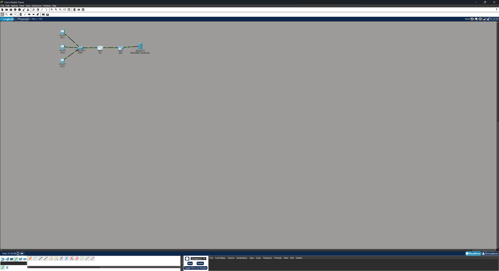
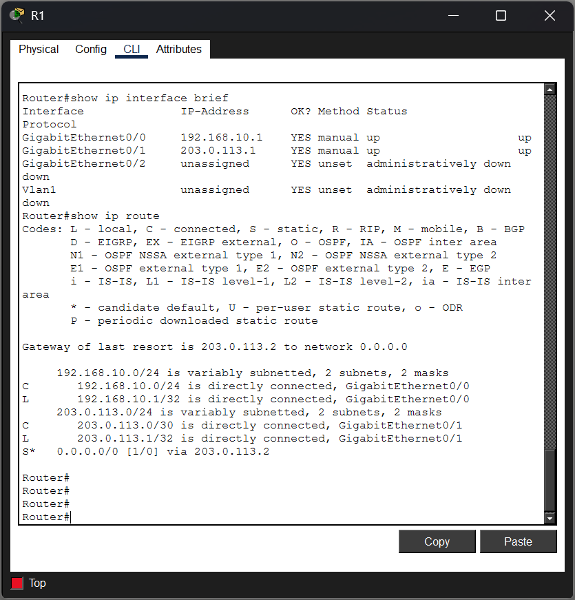
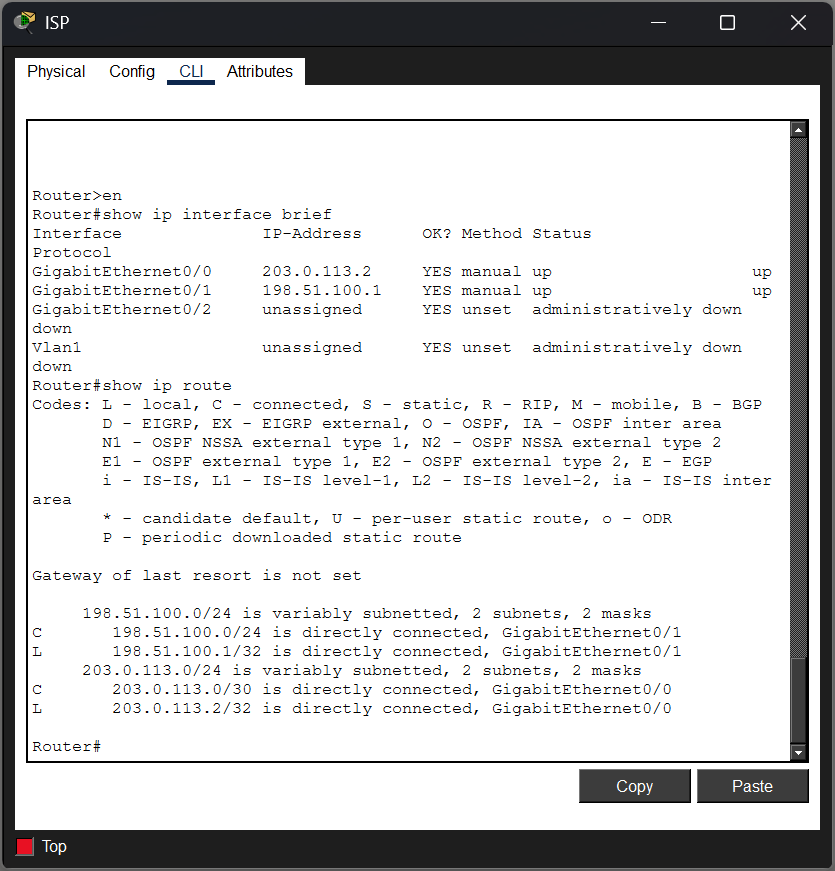
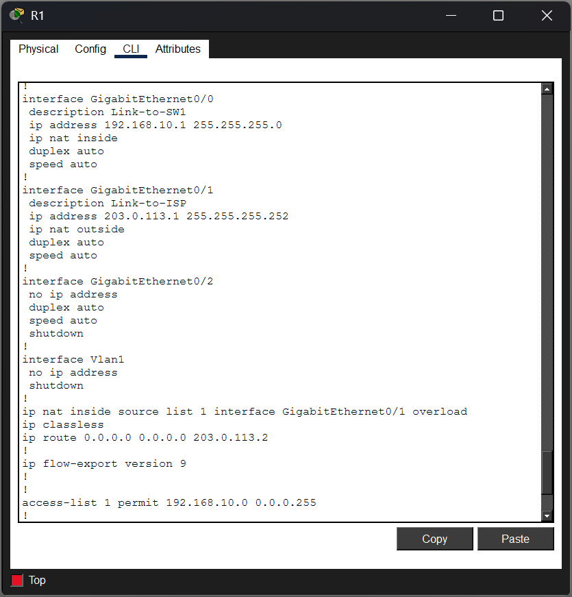
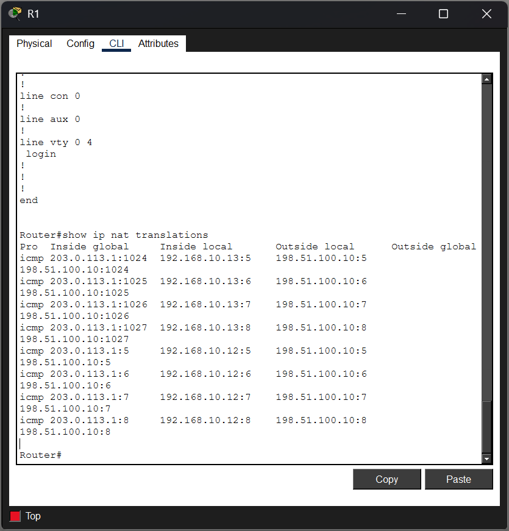
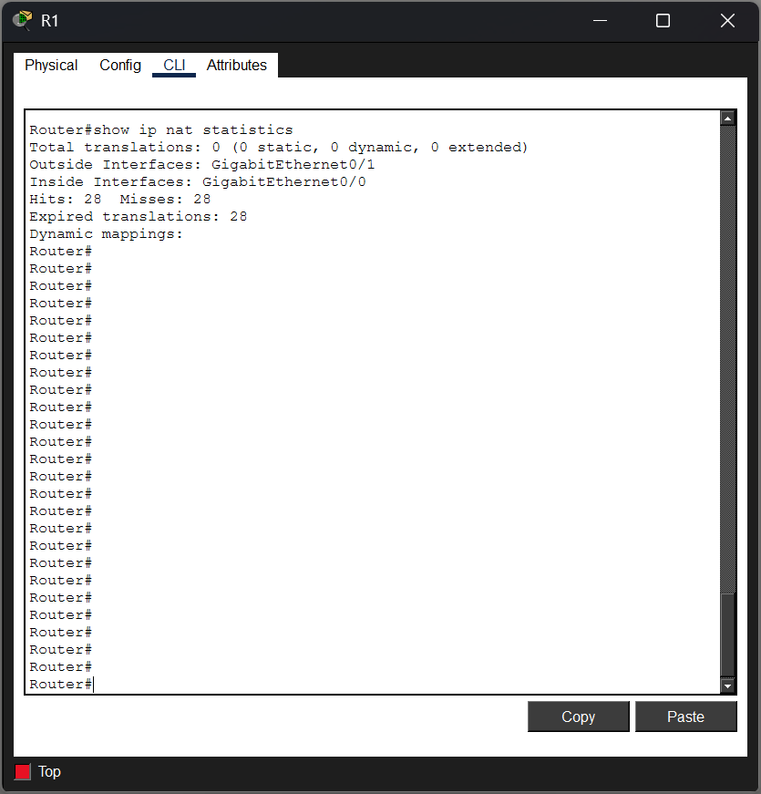

# Networking Lab #6 — NAT/PAT & Internet Edge

## Overview

This lab demonstrates the configuration and troubleshooting of Network Address Translation (NAT), Port Address Translation (PAT), and default routing in a simulated enterprise Internet-edge environment using Cisco Packet Tracer.

The network contains three internal hosts using private IPv4 addresses, an enterprise edge router, a simulated ISP router, and an external server. PAT allows all internal hosts to access the external network while sharing a single outside IPv4 address.

The lab also includes a troubleshooting scenario in which internal users could reach their default gateway but could no longer access external resources. Cisco IOS verification commands were used to isolate the problem to an incorrect NAT interface configuration and restore connectivity.

## Objectives

- Configure an internal private IPv4 network
- Configure an enterprise-to-ISP WAN connection
- Configure a simulated external network
- Configure a default route toward the ISP
- Identify NAT inside and outside interfaces
- Configure a standard ACL to identify NAT-eligible traffic
- Configure PAT using NAT overload
- Verify NAT translations
- Demonstrate multiple private hosts sharing one outside IPv4 address
- Troubleshoot a NAT-related connectivity failure
- Verify successful service restoration

## Network Topology

The topology consists of:

- 1 Cisco 2911 enterprise router (R1)
- 1 Cisco 2911 ISP router
- 1 Cisco 2960 switch (SW1)
- 3 internal PCs
- 1 simulated Internet server

Internal hosts connect to SW1, which connects to R1. R1 serves as the enterprise Internet-edge router and connects to the simulated ISP. The ISP provides connectivity to the external server network.



## IP Addressing

| Device | Interface | IP Address | Subnet Mask | Purpose |
|---|---|---|---|---|
| PC1 | Fa0 | 192.168.10.11 | 255.255.255.0 | Internal Host |
| PC2 | Fa0 | 192.168.10.12 | 255.255.255.0 | Internal Host |
| PC3 | Fa0 | 192.168.10.13 | 255.255.255.0 | Internal Host |
| R1 | G0/0 | 192.168.10.1 | 255.255.255.0 | Internal Gateway / NAT Inside |
| R1 | G0/1 | 203.0.113.1 | 255.255.255.252 | ISP Link / NAT Outside |
| ISP | G0/0 | 203.0.113.2 | 255.255.255.252 | Enterprise Link |
| ISP | G0/1 | 198.51.100.1 | 255.255.255.0 | External Network Gateway |
| INTERNET-SERVER | Fa0 | 198.51.100.10 | 255.255.255.0 | Simulated Internet Server |

The internal network uses the private `192.168.10.0/24` address space.

The `203.0.113.0/30` and `198.51.100.0/24` networks are used in this lab to simulate public-facing infrastructure.

## Interface and Routing Verification

R1 was configured with:

- `G0/0` facing the internal LAN
- `G0/1` facing the ISP

Cisco IOS verification commands were used to confirm interface addressing and routing information.

```text
show ip interface brief
show ip route
```



## Default Route

R1 requires a route for destinations that are not directly connected.

A default route was configured toward the ISP:

```text
ip route 0.0.0.0 0.0.0.0 203.0.113.2
```

This produces a gateway of last resort pointing toward the ISP:

```text
S* 0.0.0.0/0 [1/0] via 203.0.113.2
```

This allows R1 to forward traffic for unknown external networks toward the ISP.



## NAT/PAT Configuration

A standard ACL was created to identify the internal addresses eligible for translation:

```text
access-list 1 permit 192.168.10.0 0.0.0.255
```

R1's LAN-facing interface was configured as the NAT inside interface:

```text
interface GigabitEthernet0/0
 ip nat inside
```

The ISP-facing interface was configured as the NAT outside interface:

```text
interface GigabitEthernet0/1
 ip nat outside
```

PAT was then configured using R1's outside interface address:

```text
ip nat inside source list 1 interface GigabitEthernet0/1 overload
```

The `overload` keyword allows multiple internal devices to share the IPv4 address assigned to `G0/1`.



## PAT Translation Verification

External traffic was generated from multiple internal hosts by pinging the simulated Internet server:

```text
ping 198.51.100.10
```

R1's translation table was then examined:

```text
show ip nat translations
```

The output demonstrated that both:

```text
192.168.10.12
192.168.10.13
```

were translated to the same inside-global address:

```text
203.0.113.1
```

The ICMP translations were distinguished using separate identifiers.

This demonstrates PAT allowing multiple private hosts to communicate externally while sharing one outside IPv4 address.



## NAT Terminology

The NAT translation table contains four important address classifications:

| NAT Term | Meaning | Example |
|---|---|---|
| Inside Local | Address assigned to the internal host | 192.168.10.12 |
| Inside Global | Address representing the internal host externally | 203.0.113.1 |
| Outside Local | External host address as seen from the inside network | 198.51.100.10 |
| Outside Global | External host's globally represented address | 198.51.100.10 |

In this topology, the outside local and outside global addresses are identical because no translation is being performed on the external server's address.

## Troubleshooting Scenario — Ticket #007

### Reported Issue

Internal users reported that they could access resources on the local network but could no longer reach the external server at:

```text
198.51.100.10
```

The issue affected multiple internal workstations.

### Step 1 — Verify Local Connectivity

PC1 was first tested against its default gateway:

```text
ping 192.168.10.1
```

Result:

```text
4 packets sent
4 packets received
0% packet loss
```

This confirmed connectivity between the workstation and R1.

External connectivity was then tested:

```text
ping 198.51.100.10
```

Result:

```text
4 packets sent
0 packets received
100% packet loss
```

The problem therefore occurred beyond basic PC-to-gateway connectivity.

### Step 2 — Verify Routing

R1's routing table was examined:

```text
show ip route
```

The default route was still present:

```text
S* 0.0.0.0/0 [1/0] via 203.0.113.2
```

R1 also retained its directly connected internal and ISP-facing networks.

This indicated that the failure was not caused by the loss of R1's default route.

### Step 3 — Investigate NAT

NAT statistics were examined:

```text
show ip nat statistics
```

The output showed:

```text
Outside Interfaces: GigabitEthernet0/1
Inside Interfaces:
```

The outside interface was correctly identified, but no inside NAT interface was present.

### Root Cause

`GigabitEthernet0/0` had lost its NAT inside designation.

Without:

```text
ip nat inside
```

R1 did not treat traffic entering the LAN-facing interface as inside traffic eligible for NAT/PAT processing.

### Remediation

The NAT inside configuration was restored:

```text
configure terminal
interface GigabitEthernet0/0
 ip nat inside
end
```

### Verification

NAT statistics were checked again to verify the correct interface roles:

```text
Outside Interfaces: GigabitEthernet0/1
Inside Interfaces: GigabitEthernet0/0
```

PC1 then successfully reached the external server:

```text
ping 198.51.100.10
```

Result:

```text
4 packets sent
4 packets received
0% packet loss
```

External connectivity was successfully restored.



## Troubleshooting Methodology

The troubleshooting process followed an evidence-based approach:

```text
Reported Symptom
      ↓
Verify Endpoint-to-Gateway Connectivity
      ↓
Verify R1 Routing Table
      ↓
Confirm Default Route
      ↓
Inspect NAT Statistics
      ↓
Identify Missing NAT Inside Interface
      ↓
Restore Configuration
      ↓
Verify NAT Interface Roles
      ↓
Test End-to-End Connectivity
```

Rather than making multiple configuration changes at once, each layer of the path was verified before moving to the next potential cause.

## Key Takeaways

This lab reinforced several networking concepts:

- Private IPv4 hosts require translation when communicating through a NAT-based Internet edge.
- A default route provides a path toward networks not explicitly present in the routing table.
- NAT requires correct identification of inside and outside interfaces.
- Standard ACLs can identify which internal source addresses are eligible for NAT.
- PAT allows multiple internal devices to share a single outside IPv4 address.
- `show ip nat translations` provides visibility into active translations.
- `show ip nat statistics` helps verify NAT interface roles and translation activity.
- Successful gateway connectivity does not guarantee successful external connectivity.
- Troubleshooting should move from verified facts toward the point where expected behavior stops.

## Skills Demonstrated

- Cisco IOS
- IPv4 Addressing
- Subnetting
- Static Default Routing
- Network Address Translation (NAT)
- Port Address Translation (PAT)
- NAT Overload
- Access Control Lists
- Cisco IOS Verification Commands
- Network Troubleshooting
- Internet Edge Configuration
- Packet Tracer Network Simulation
- Technical Documentation

## Files

- `Networking-Lab-06-NAT-PAT-Internet-Edge.pkt` — Cisco Packet Tracer lab file
- `screenshots/` — Configuration, verification, translation, and troubleshooting evidence

---

*This lab is part of my hands-on networking portfolio focused on developing practical Cisco networking, troubleshooting, and network operations skills.*
